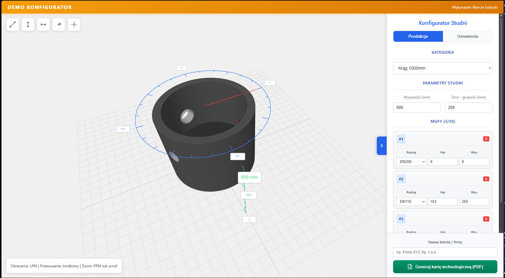
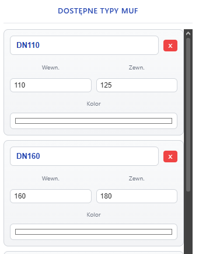
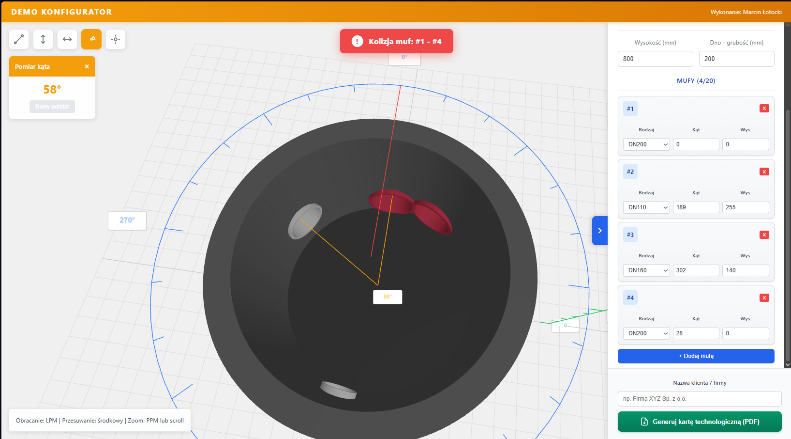
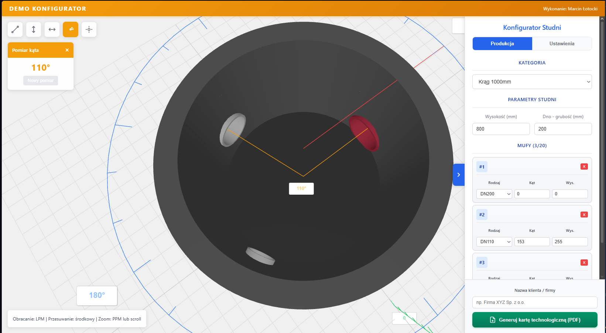
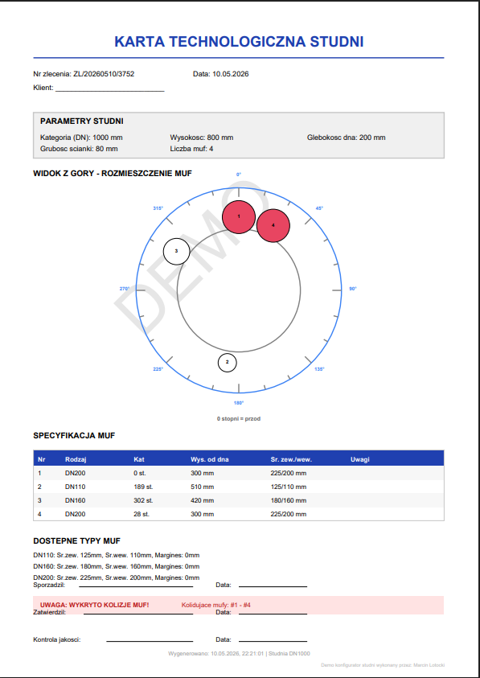
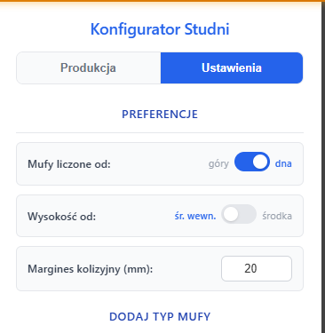

# Studnia 3D Konfigurator

Zaawansowany konfigurator 3D studni kanalizacyjnych napisany w **Vue.js 3** i **Three.js**.



## Funkcje

### Konfiguracja studni
- Wybór średnicy: DN1000 lub DN1200
- Regulowana wysokość: 500-3000mm
- Regulowana głębokość dna: 50-500mm
- Renderowanie 3D w czasie rzeczywistym

### Zarządzanie mufami
- Dodawanie do 20 muf na modelu
- 3 predefiniowane typy (DN110, DN160, DN200)
- Tworzenie własnych typów z dowolną średnicą i kolorem
- Edycja pozycji (kąt 0-360°, wysokość)
- Dokładne wycinanie otworów w ścianie studni (CSG)



### Detekcja kolizji
- Automatyczne wykrywanie kolizji między mufami
- Regulowany margines bezpieczeństwa (0-200mm)
- Wizualne ostrzeżenia
- Tryb debugowania (Ctrl+Shift+D)



### Narzędzia pomiarowe
- Pomiar odległości 3D
- Pomiar różnicy wysokości
- Pomiar odległości poziomej
- Pomiar kąta
- Inteligentne przyciąganie do środków muf



### Eksport do PDF
- Profesjonalna karta techniczna
- Widok z góry z podziałką kątową
- Szczegółowa tabela specyfikacji muf
- Ostrzeżenia o wykrytych kolizjach
- Linie na podpisy



### Ustawienia
- Pomiar wysokości od dołu/góry
- Pomiar od środka/wewnętrznej powierzchni
- Zapisywanie preferencji w cookies



## Technologie

- **Vue.js 3.5** - framework reaktywny
- **Vite 8** - narzędzie budowania
- **Three.js 0.184** - renderowanie 3D
- **three-bvh-csg** - operacje CSG (wycinanie otworów)
- **jsPDF** - generowanie dokumentów PDF
- **OrbitControls** - sterowanie kamerą 3D

## Instalacja i uruchomienie

```bash
# Instalacja zależności
npm install

# Uruchomienie serwera deweloperskiego
npm run dev

# Budowanie wersji produkcyjnej
npm run build

# PodglądBuildu
npm preview
```

Aplikacja będzie dostępna pod adresem: `http://localhost:5173/`

## Struktura projektu

```
src/
├── App.vue                      # Główny komponent
├── main.js                      # Punkt wejścia
├── components/
│   ├── SceneViewer.vue         # Kontener sceny 3D + narzędzia
│   ├── Panel.vue                # Panel kontrolny
│   ├── PanelKategoria.vue      # Wybór średnicy
│   ├── PanelParametry.vue      # Wysokość i głębokość
│   ├── PanelMufyProdukcja.vue  # Edytor muf
│   └── PanelTypyMuf.vue        # Zarządzanie typami muf
├── composables/
│   ├── useThreeScene.js        # Logika sceny 3D
│   └── usePdfExport.js         # Eksport do PDF
└── stores/
    └── studniaStore.js         # Centralny stan reaktywny
```

## Kluczowe rozwiązania techniczne

### CSG Boolean Operations
Realne wycinanie otworów w geometrii ściany studni przy użyciu biblioteki `three-bvh-csg`:

```javascript
const wallBrush = new Brush(wallGeometry)
const pipeBrush = new Brush(pipeGeometry)
const result = evaluator.evaluate(wallBrush, pipeBrush, SUBTRACTION)
```

### Inteligentne pomiary
Punkty pomiarowe automatycznie "przyczepiają się" do muf i aktualizują pozycję gdy mufa jest przesuwana.

### Responsywny design
- Desktop: panel boczny + pełny widok 3D
- Tablet: adaptacyjna szerokość panelu
- Mobile: panel na pełny ekran z gestem zamykania

## Licencja

MIT License - zobacz plik [LICENSE](LICENSE)

## Autor

Projekt stworzony jako konfigurator do projektowania studni kanalizacyjnych.
